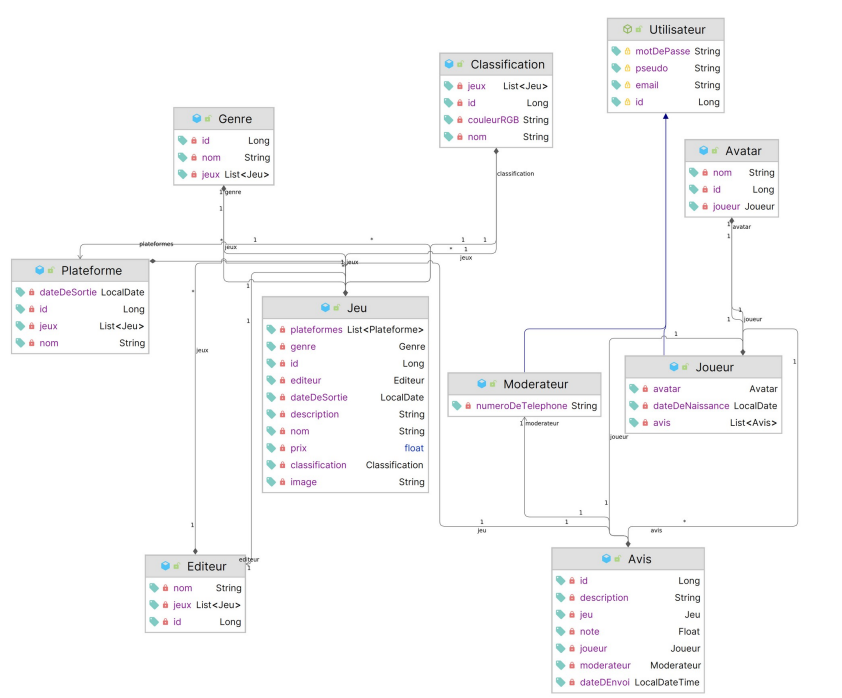
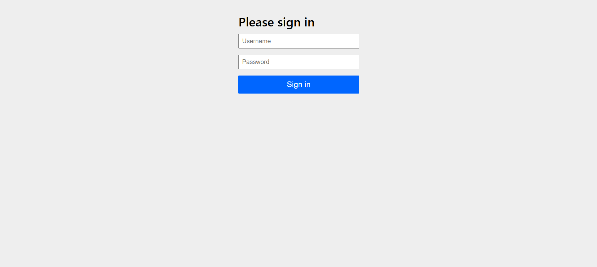
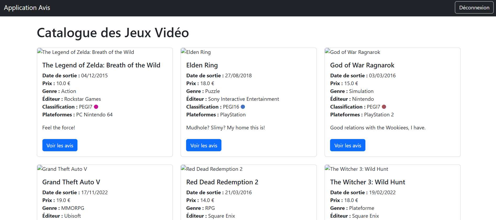
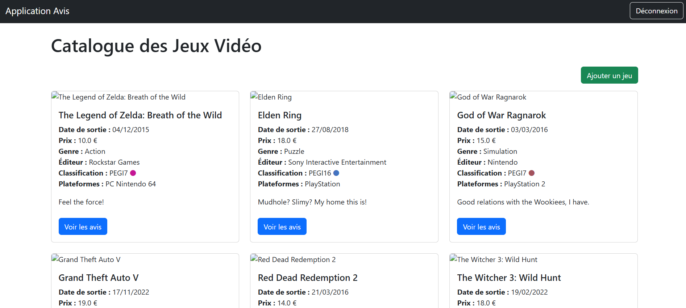
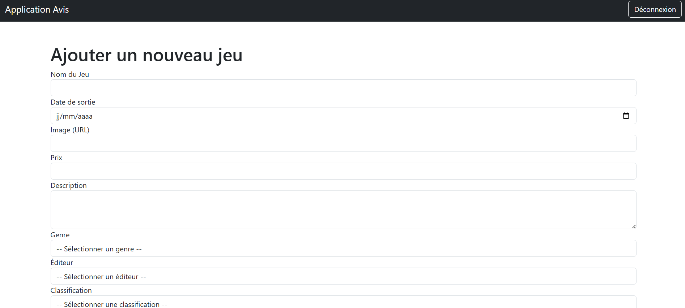
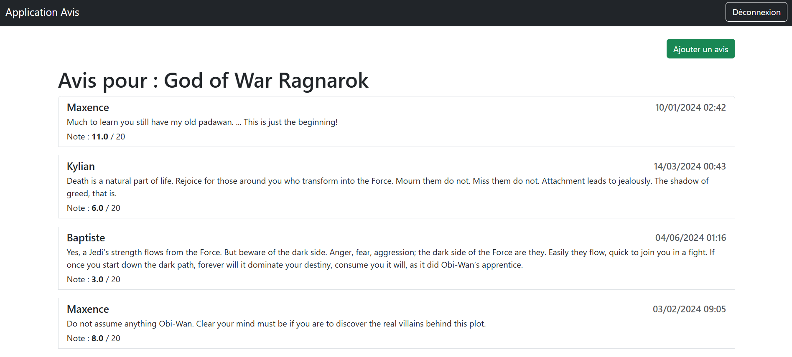
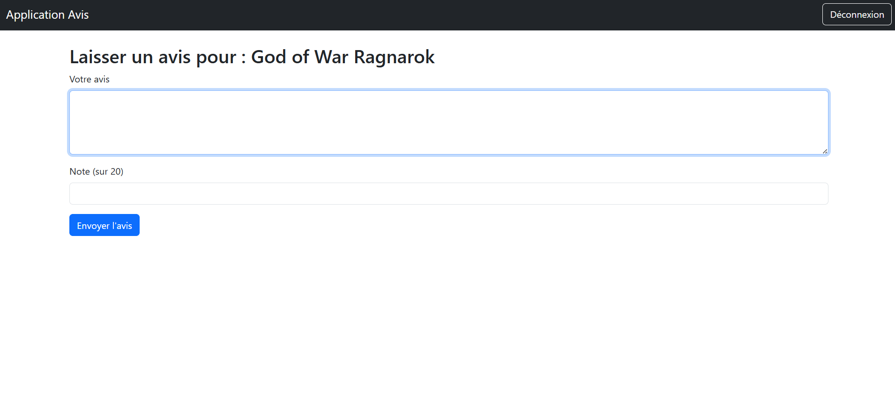
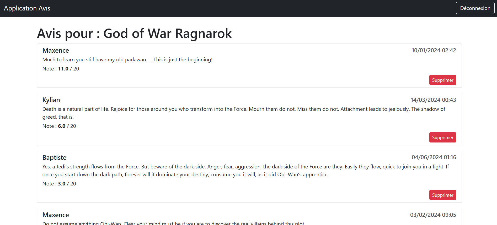

# Software architecture : heuristiques et compromis

## Sommaire
1. [Présentation du projet](#présentation-du-projet)
2. [Architecture employée](#architecture-employée)
3. [Respect des normes REST et SOLID](#respect-des-normes-rest-et-solid)
4. [Diagrammes](#diagrammes)
5. [Sécurité](#securite)
6. [Exemple de l'application une fois lancée](#exemple-de-lapplication-une-fois-lancée)
7. [Tests unitaires et tests d'intégration](#tests-unitaires-et-tests-dintégration)


## Présentation du projet

1. Participants au projet
    - Yannick Boyer, M2 AL
    - Robin Peignet, M2 AL

2. Contexte du projet \
Ce projet est réalisé dans le cadre de notre dernière année de master à l'ESGI Science-U Lyon et est lié au module `Software architecture : heuristiques et compromis`.

3. Objectif \
Pour ce projet, nous devons reprendre une solution réalisée en M1 et la re-développée afin de la centrer autour du besoin métier pour ainsi être conforme aux principes de `Clean Architecture`. \
Il s'agit principalement d'une application de gestion sur le thème des `jeux vidéo` et des `avis` autour de ces derniers.

4. Besoins métiers
Ce projet dispose de plusieurs besoins, selon différentes catégories d'utilisateur : 
    - Joueur
        - Connexion / déconnection
        - Voir les jeux
        - Voir les avis
        - Rédiger un avis
    - Modérateur
        - Connexion / déconnection
        - Voir les jeux
        - Ajouter des jeux
        - Voir les avis
        - Modérer les avis

## Architecture employée

1. Base de données et diagramme de classe

Pour ce projet développé en `Java` avec le `Framework Spring`, les données seront stockées `en mémoire` avec une `Base H2`. \
Nous avons choisi de conserver le diagramme de classe représentant les entités de l'application du sujet original.



2. Les classes métiers

L'objectif de ce projet est de centrer le développement autour des besoins métiers de l'application, on développe donc en premier les classes métiers. \
Elles qui seront utilisées pour écrire la logique propre au métier et donc séparées de la partie persistance.

Elles doivent rester le plus simple possible, on garde les propriétés de la classe, mais on enlève les annotations ou autres éléments qui viendraient du Framework : 
```java
public class Genre {
    private Long id;
    private String nom;
}
```

Bien sûr, on écrit également pour ces classes les constructeurs, getter et setter dont nous avons besoin.

3. Les classes d'entité

Ces classes sont suffixées `Entity`. Elles sont utilisées pour décrire la persistance des données et possèdent donc les annotations utilisées par le framework pour gérer par exemple des contraintes de table.

```java
@Entity
public class GenreEntity {
    @Id
    @GeneratedValue(strategy= GenerationType.IDENTITY)
    private Long id;

    @NonNull
    private String nom;
}
```

Chaque classe d'entité correspond à une classe métier. Pour gérer efficacement ces correspondances, on met un place des `mappers` grâce à la librairie `Mapstruct` : 

```java
@Mapper(
        unmappedTargetPolicy = ReportingPolicy.IGNORE,
        componentModel = MappingConstants.ComponentModel.SPRING
)
public interface GenreMapper {
    Genre toBusiness(GenreEntity entity);

    GenreEntity toEntity(Genre business);
}
```

4. Les repositories

Pour gérer les opération en base de données, nous utiliserons les repositories JPA. Nous les associerons donc aux classes d'entité évoqué plutôt : 

```java
public interface GenreRepository extends JpaRepository<GenreEntity, Long> {
}
```

5. Les adapters

Pour lier tous les éléments abordés précédemment, nous mettrons en place des adapters.

Ces classes font `le lien` entre la gestion de `la persistance` et `la logique métiers` (entre les entités et les classes métiers).

Concrètement, ils reçoivent et renvoient des objets métiers (dans notre cas `Genre`) et effectuent des opérations sur les Entités (`GenreEntity`) grâce au mappers et au repositories.

Exemple avec la classe `AvisJpaAdapter` :
```java
@Component
public class GenreJpaAdapterImpl implements GenreJpaAdapter{
    private final GenreMapper mapper;
    private final GenreRepository repository;

    public GenreJpaAdapterImpl(GenreMapper genreMapper, GenreRepository genreRepository){
        this.mapper = genreMapper;
        this.repository = genreRepository;
    }

    @Override
    public Genre save(Genre genre) {
        final GenreEntity entity = mapper.toEntity(genre);
        return mapper.toBusiness(repository.save(entity));
    }
}
```

Explication : On observe ici dans un premier temps l'injection du repository et du mapper dans notre adapter. \
Dans l'exemple de la méthode `save`, on récupère en paramètre `une classe métier` Genre, que l'on transforme grâce au mapper en `classe d'entité` GenreEntity. \
Grâce à cette transformation, on peut utiliser le `repository` (qui lui aussi manipule des entités) pour effectuer `le traitement`. \
Une fois l'opération terminée, on renvoie les données de nouveau sous forme `d'objet métier`.

*Grâce à cet adapter, on parvient donc à `séparer` la persistance de la logique métier.*

6. Les UseCases

Les classes UseCase correspondent à `nos services`. \
Ils utilisent les fonctions des `adapters` et s'occupent de `la partie métier`. Comme nous avons pris soin d'isoler les différentes les couches de l'application, ces usecases se servent uniquement `les classes métiers`.

```java
@Service
public class GenreUseCaseImpl implements GenreUseCase{
    private final GenreJpaAdapter jpaAdapter;

    public GenreUseCaseImpl(GenreJpaAdapter jpaAdapter) {
        this.jpaAdapter = jpaAdapter;
    }

    @Override
    public Genre findById(Long id){
        final Optional<Genre> optionalGenre = jpaAdapter.findById(id);
        if(optionalGenre.isPresent()){
            return optionalGenre.get();
        }else{
            throw new GenreNotFoundException(id);
        }
    }
}
```

7. Les RestController

Enfin, les usecases sont utilisés par les controllers REST. \
Ils correspondent aux points d'entrées de l'API, et comminuquent avec les services qui exploiteront cette dernière.

Ils possèdent eux aussi avec un autre format d'objet : Les DTO's (d'entrée et de sortie).

```java
@RestController
@RequestMapping("/api/Genres")
public class GenreRestController {
    private final GenreUseCase useCase;
    private final GenreDtoMapper mapper;

    public GenreRestController(GenreUseCase genreUseCase, GenreDtoMapper genreMapper) {
        this.useCase = genreUseCase;
        this.mapper = genreMapper;
    }

    @PostMapping
    @ResponseStatus(code = HttpStatus.CREATED)
    public GenreResponseDTO create(@RequestBody GenreRequestDTO requestDTO){
        final Genre genre = mapper.toBusiness(requestDTO);
        return mapper.toDto(useCase.save(genre));
    }
}
```

Pour assurer la correspondance entre DTO et classe d'entité, on remarque que les controllers REST utilisent également des mappers.

## Respect des normes REST et SOLID

1. Les normes REST

Nous veillerons à ce que l'API suive une logique `Restful`, ce qui signifie qu’elle utilisera `les protocoles HTTP standards` (GET, POST, PUT, DELETE) pour effectuer `des opérations CRUD` (Create, Read, Update, Delete) sur des ressources identifiées par des URI.

Cette notion sera en grande partie représentée par la partie `RestController`.
En effet, on portera une attention sur `le nommage des routes` (racine au pluriel...), on utilisera `les annotations Spring` pour décrire le type de méthode employée, et la réponse attendue.

Exemple avec le GenreRestController : 
```java
@RestController
@RequestMapping("/api/Genres")
public class GenreRestController {
    @PostMapping
    @ResponseStatus(code = HttpStatus.CREATED)
    public GenreResponseDTO create(@RequestBody GenreRequestDTO requestDTO){}

    @DeleteMapping("/{id}")
    @ResponseStatus(code = HttpStatus.NO_CONTENT)
    public void delete(@PathVariable Long id){}
}
```

2. Les principes SOLID

*Les principes SOLID sont des principes de conception destinés à produire des architectures plus compréhensibles, flexibles et évolutives.*

**Single Responsibility** : Chaque classe à une responsabilité. \
    - On voit que chaque classe abordée possède son propre objectif (Les `RestControllers` gèrent les requêtes HTTP, les `UseCases` encapsulent la logique métier, les `Adapters` la persistance...)

**Open/Closed Principle** : Les classes sont ouvertes à l'extension, mais fermées à la modification. \
    - Comme nous avons veillé à correctement découper notre code, on peut `facilement ajouter des fonctionnalités` sans avoir à `modifier le code existant`.

**Liskov Substitution** : Les instances d'une classe dérivée doivent être utilisées comme la classe de base sans comportement inattendus. \
    - Les `UseCases` et `Adapters` possèdent des `interfaces` qui leurs sont propres, ce qui `garantit` que l'on peut modifier l'une de ces implémentations `sans altérer le comportement original`.

**Interface Segregation** : Les classes ne doivent pas être forcées d'utiliser des interfaces dont elles n'ont pas besoin. \
    - On préférera utiliser `plusieurs petites interfaces` a lieu d'une plus conséquente et partagée. \
    Exemple avec l'interface du `ModerateurJpaAdapter` : 

```java
public interface ModerateurJpaAdapter {
    Optional<Moderateur> findById(Long id);
    List<Moderateur> findAll();
}
```

**Dependency Inversion** : On préfère utiliser des interfaces dans les injections de dépendance au lieu de classe concrètes pour mieux découper le code et le rendre plus testable. \
    - Nos `Adapters` dépendent des interfaces des repositories (fournis par JPA). \
    - Nos `UseCase` injectent les interfaces des adapters associés. \
    - Enfin, nos `RestController` utilisent aussi des interfaces pour les useCases.


## Diagrammes

## Sécurité

La gestion de la connexion et de la session est gérée avec la librairie `SpringSecurity`. \
Dans l'application Avis, elle nous permet notamment de gérer les comportements en cas de login et logout, ainsi que de gérer les `permissions` en fonction des rôles de l'utilisateur connecté.

Exemple de configuration : 
```java
// Liste de jeux visible par différents types d'utilisateur
.requestMatchers("/jeux").hasAnyRole("JOUEUR", "MODERATEUR")

// Création d'un jeu uniquement pour les modérateur
.requestMatchers("/jeux/create").hasAnyRole("MODERATEUR")
```

## Exemples de l'application une fois lancée

1. Login (SpringSecurity)


2. Liste des jeux (joueur)


3. Liste des jeux (modérateur)


4. Ajout d'un jeu (modérateur)


5. Voir les avis (joueur)


6. Ajouter un avis (joueur)


7. Voir les avis (modérateur)



## Tests unitaires et tests d'intégration

Enfin, pour vérifier la qualité du code produit, nous avons mis en place une série de `tests unitaires` et de `tests d'intégration`. \
Ces tests ciblent `les couches suivantes` : 
- Business / classe métier
- Repository
- Adapter
- UseCase
- RestController

Exemple de test unitaire sur le `GenreJpaAdapter` : 
```java
@SpringBootTest
@TestMethodOrder(MethodOrderer.OrderAnnotation.class)
class GenreJpaAdapterTest {
    @Autowired
    private GenreJpaAdapter adapter;

    @Test
    @Order(1)
    void shouldSaveGenreAsBusiness(){
        final Genre genre = adapter.save(new Genre("Action aventure"));
        assertNotNull(genre.getId());
        assertEquals("Action aventure", genre.getNom());
    }
}
```

Exemple de test d'intégration sur le `EditeurRestController` avec la création d'un éditeur par requête HTTP : 
```java
@Test
@Order(1)
void shouldCreateEditeur() throws Exception {
    final EditeurRequestDTO editeur = new EditeurRequestDTO();
    editeur.nom = "Kepler Interactive";

    String url = "/api/Editeurs";
    mockMvc.perform(
        post(url)
        .contentType(MediaType.APPLICATION_JSON)
        .content(objectMapper.writeValueAsString(editeur)))
        .andExpect(status().isCreated());
}
```